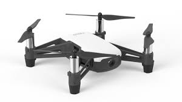

<h1> Dron_TL</h1> 

<br> In this repository i use ROS to develop a new driver for the dji tello dron </br>
<br> the main idea of this repo is develop a new driver of the tello dron where don't use av </br>
<br> library, which have a few problems with the new ffmpeg version of ubuntu </br>
<br> This repo use the TCP/UDP protocol to communicate the tello dron whit ROS </br>

<h3>Hardware used</h3>
<ul>
	<li>DJI Tello Dron</li>
	 
</ul>

<br> At this momment i only have 2 node </br>
<ul>
	<li>Init node: init.py</li>
	<ul>
		<br>This node initialize the command phase on the dron </br>
	</ul>
	<li>Video stream: video_tello.py</li>
	<ul>
		<br>This node start the video and put on a image topic of ROS </br>
	</ul>
</ul> 

<h3> Commands to run the workspace </h3>

```bash
# Start the ROS core
roscore

# Start the dron command phase
rosrun tello_driver init.py

#Start the stream video 
rosrun tello_driver video_tello.py

```
<h3>Future features</h3>
<ul>
	<li>Odometry response</li>
	<li>Control commands</li>
	<li>Sensors respons like: battery charge, imu data, speed, current fly time and height</li>
	<li>Package all this node on a single launch file (final)</li>
</ul>